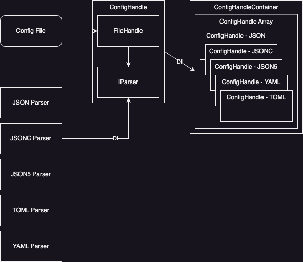

# config-valley

config-valley는 configuration을 다양한 형식에서 읽어들여서 반환하는 간단한 유틸리티입니다. CLI 유틸리티를 개발할 때 사용자 편의를 제공하기 위해 package.json 또는 tsconfig.json 파일, 커스텀 설정 파일 등에서 설정을 읽어오는 기능이 필요합니다. config-valley는 DI를 사용하여 다양한 형식(json, jsonc, json5, yaml, toml)의 원천에서 configuration을 일관성있게 읽어오는 기능을 제공합니다.

1. json, jsonc(comment-json), json5, yaml, toml 지원
2. DI를 사용하여 설정 파일 읽기 개인화 지원

config-valley를 사용하여 설정 파일을 간소화하고 스케폴딩의 품질을 높이세요!

## installation

```bash
# npm
npm install config-valley --save

# yarn
yarn install config-valley --save

# pnpm
pnpm add config-valley --save
```

## Usage



config-valley는 그림과 같은 구조를 가지고 있습니다. Config 파일(package.json 또는 tsconfig.json 파일 포함)를 읽기 위한 FileHandle 클래스, 읽은 파일을 파싱하기 위한 IParser 인터페이스를 구현한 클래스, FileHandle과 IParser를 가진 ConfigHandle, ConfigHandle을 여러개 가지고 있는 ConfigHandleContainer로 구성됩니다.

실제로 사용할 때는 ConfigHandleContainer에 필요한 Parser를 가진 ConfigHandle을 전달하여 사용할 수 있습니다.

```ts
import pathe from 'pathe';
import { 
  ConfigHandleContainer, 
  ConfigHandle,
  JsonKeyParser,
  PackageJsonParser,
  TsconfigJsonParser
} from 'config-valley';

function getConfigHandle() {
  const filename = 'your configuration file name, for example, .appconfig';

  const handle = new ConfigHandleContainer({
    handles: [
      ConfigHandle.factory(
        new JsonKeyParser(args?.configKey),
        pathe.join(process.cwd(), filename),
      ),
      ConfigHandle.factory(pathe.join(process.cwd(), filename)),
      ConfigHandle.factory(
        new PackageJsonParser(args?.configKey),
        pathe.join(process.cwd(), 'package.json'),
      ),
      ConfigHandle.factory(
        new TsconfigJsonParser(args?.configKey),
        pathe.join(process.cwd(), 'tsconfig.json'),
      ),
    ]
  });

  return handle;
}

const handle = getConfigHandle();
const config = await handle.read();

// show your configuration
console.log(config);

// change configuration
config.output = 'mytools/dist'

// save your configuration
await container.write(config)
```

## 어떻게 여러가지 형식을 읽을 수 있습니까?

config-valley는 여러 출처에 있는 설정 파일을 읽을 수 있어야 하기 때문에 FileHandle, Parser를 ConfigHandle로 결합하여 다양한 형식을 읽을 수 있습니다. FileHandle 또는 Parser에서 Exception이 발생하면 다음 ConfigHandle을 사용하여 설정 읽기를 시도하고 모든 ConfigHandle이 실패하는 경우 ConfigHandleContainer에서 Exception을 발생시킵니다.

## 동기식 vs 비동기식

용도에 따라 SyncConfigHandle, SyncConfigHandleContainer 또는 ConfigHandle, ConfigHandleContainer를 사용할 수 있습니다. 둘의 사용법은 동일하지만 FileHandle 및 IParser 구현체 모두 동기식 또는 비동기식에 맞게 구현해야 합니다.

## 지원 형식

json, jsonc, json5, yaml, toml을 지원합니다. package.json 또는 tsconfig.json 파일에서 설정을 추출할 때는 특정 키에서 설정을 추출합니다. 이 방식을 package.json 또는 tsconfig.json 파일 외 다른 파일에서 추출할 수 있도록 지원합니다. 이 경우에는 Json5KeyParser, YamlKeyParser, TomlKeyParser를 사용하면 입력한 파일에서 입력한 키 값을 추출해서 설정으로 사용할 수 있습니다.

```ts
function getConfigHandle() {
  const filename = 'your configuration file name, for example, .appconfig';

  const handle = new ConfigHandleContainer({
    handles: [
      ConfigHandle.factory(
        new TomlKeyParser(args?.configKey),
        pathe.join(process.cwd(), filename),
      ),
    ]
  });

  return handle;
}
```

| Class Name | Usage |
| :- | :- |
| JSONParser | JSONParser는 JSON 형식을 파싱합니다 |
| JSONKeyParser | JSONKeyParser는 JSON 형식을 파싱한 뒤 특정 키에서 데이터를 추출합니다 |
| JSONCParser | JSONCParser는 JSON with Comments 형식을 파싱합니다 |
| JSONCKeyParser | JSONCParser는 JSON with Comments 형식을 파싱한 뒤 특정 키에서 데이터를 추출합니다 |
| JSON5Parser | JSONParser는 JSON5 형식을 파싱합니다 |
| JSON5KeyParser | JSON5KeyParser는 JSON5 형식을 파싱한 뒤 특정 키에서 데이터를 추출합니다 |
| YamlParser | YamlParser는 YAML 형식을 파싱합니다 |
| YamlKeyParser | YamlKeyParser는 YAML 형식을 파싱한 뒤 특정 키에서 데이터를 추출합니다 |
| TomlParser | TomlParser는 TOML 형식을 파싱합니다 |
| TomlKeyParser | TomlKeyParser는 YAML 형식을 파싱한 뒤 특정 키에서 데이터를 추출합니다 |
| PackageJsonParser | PackageJsonParser는 package.json 파일을 파싱한 뒤 특정 키에서 데이터를 추출합니다 |
| TsconfigJsonParser | TsconfigJsonParser는 tsconfig.json 파일을 파싱한 뒤 특정 키에서 데이터를 추출합니다 |

## License

This software is licensed under the [MIT](LICENSE).
